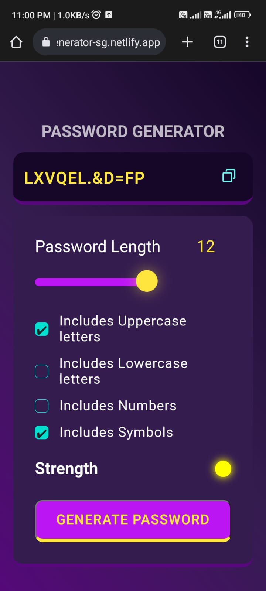

# Password Generator

The Web-Based Password Generator is an online tool designed to help users create strong and secure passwords for their various online accounts and applications. This project aims to provide an easily accessible and user-friendly solution for generating complex passwords to enhance online security.

- **Link :**  [Click Here](https://password-generator-sg.netlify.app/)
## Key Features:
- **User Interface:** The web application will feature a clean and intuitive user interface that allows users of all skill levels to generate passwords with ease.
- **Password Complexity Options:** Users can select the level of complexity for their passwords, including options like uppercase letters, lowercase letters, numbers, and special characters.

- **Password Length Customization:** Users can specify the desired length of the generated password to meet the requirements of different websites and applications.

-  **Randomization:** The generator will utilize a robust randomization algorithm to ensure the unpredictability and security of the generated passwords.

-  **Password Strength Meter:** Implement a visual indicator that dynamically assesses the strength of the generated password and provides feedback to users.

 -  **Copy to Clipboard:** Users can copy the generated password to their clipboard with a single click, making it convenient for them to use the password in registration or login forms.

- **Responsive Design:** Ensure that the web application is responsive and works seamlessly on various devices, including desktops, tablets, and smartphones.

- **Real-time Preview:** Provide users with a real-time preview of the generated password as they adjust complexity and length settings.

-  **Password Regeneration:** Incorporate a button to regenerate a new password instantly, allowing users to create different passwords quickly.

-  **No Data Storage:** Emphasize user privacy by not storing any generated passwords or personal information on the server.

 

## Technologies and Tools:

- **Front-End Development:** HTML, CSS, JavaScript 
- **User Interface:** Responsive design using CSS media queries
- **Randomization:** JavaScript's built-in `Math.random()` 
- **Version Control:** Git
- **Hosting:** Netlify

## Screenshots

## Feedback

If you have any feedback, please reach out to me at saurabhsg1230@.com

